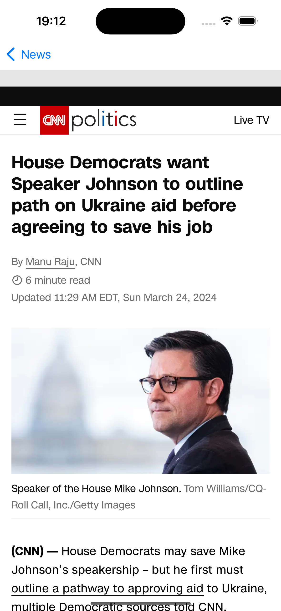

# Movie-App

This app was created as two pages. Tn the first page "newsapi.org " news withdrawn from the address are listed. On the second page, the details of these news, various features are shown.

### Keywords

<ul>
    <li>VIPER</li>
    <li>Object Oriented Programming</li>
    <li>Protocol Oriented Programming</li>
    <li>GenericNetworkLayer</li>
    <li>URLSession</li>
    <li>UIKIT</li>
    <li>TableView</li>
    <li>Codable</li>
    <li>Spm</li>
    <li>KingFisher</li>
    <li>Realm</li>
    <li>Pagination</li>
    <li>Modular Network Layer</li>
</ul>

| Home Screnn | Detail Screen |
| --------------- | --------------- |
|   |   |

